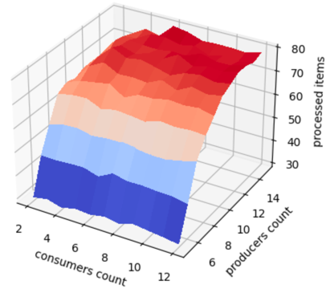

# Parallel programming and distributed systems

[](https://conventionalcommits.org)

> **Visit [subject page](https://uim.fei.stuba.sk/predmet/i-ppds) for more info.**

## Objective of the subject

The content of the course is the analysis of various synchronization patterns. Our goal is to offer students the
opportunity to become familiar with various synchronization problems along with their solutions. By synchronization
problems we mean the solution of the coordination of concurrently (perhaps also simultaneously) performed tasks in order
to ensure the integrity of the data with which the individual tasks work; of course, we also demand that a correct
calculation result be achieved.

In the second part of the semester, we focus on some modern areas of programming that are developing rapidly: parallel
calculations on graphics cards and asynchronous programming.

## Organization

1. Introduction to parallel and distributed computing
2. Mutex, multiplex, turnstile, (reusable) barrier
3. Barrier and Fibonacci revisited - Producer-consumer, readers-writers, turnstile
4. Readers / writers again - Evening philosophers
5. Smokers, savages, scoreboard
6. Barber, H20, crossing the river, caterpillar track
7. Co-programs - Iterator, generator and carter in Python
8. Async IO - Async IO in Python
9. CUDA
10. CUDA continues

___

## 3. Exercise

> **For more information about exercise visit [https://uim.fei.stuba.sk/i-ppds/3-cvicenie-fibonacci-vypinac-p-k-c-z-💡/?%2F](https://uim.fei.stuba.sk/i-ppds/3-cvicenie-fibonacci-vypinac-p-k-c-z-💡/?%2F).**

In this exercise, we had to decide whether to implement and then experiment on the synchronization task of "producers
and consumers" or "readers and writers".

I have chosen implementation and then experimentation on the synchronization task "producers and consumers", who
represent parallel threads accessing a shared space. We will not have any shared memory space in our models, but we will
demonstrate writing and reading by some random delay. The size of the imaginary shared space will be defined by the
initialization of Semaphore "storage", which will take care of synchronizing production to the shared memory space if it
is already full. Semaphore "items", which will take care of synchronizing consumption from the memory location, if there
is nothing to consume. By initializing Semaphore, we will take care of synchronizing consumption from a memory location
if there is nothing to consume.

Producers execute this code:

```python
while True:
    sleep(randint(1, 10) / 100)
    storage.wait()
    if end:
        break
    mutex.lock()
    sleep(randint(1, 10) / 1000)
    mutex.unlock()
    items.signal()
```

The first sleep delay demonstrates the production time of the item. Subsequently, Semaphore "storage" blocks threads
when the shared memory space is already full. The condition ends our infinite cycle if the main thread announces the
end. The second sleep delay demonstrates writing to shared memory space, which must be atomic. The latest Semaphore "
items" give us a signal to consumers that they have an item to process.

Consumers execute this code:

```python
while True:
    items.wait()
    if end:
        break
    mutex.lock()
    sleep(randint(1, 10) / 1000)
    mutex.unlock()
    storage.signal()
    sleep(randint(1, 10) / 100)
    processed_items_mutex.lock()
    processed_items += 1
    processed_items_mutex.unlock()
```

Semaphore "items" will block threads if they have no consumption items. Subsequently, the first sleep delay demonstrates
reading from the shared memory space, which must be atomic. Semaphore "storage" signals the producers that they have
freed up space in the shared memory. The second sleep delay demonstrates the processing of the item, followed by the
incrementation of the processed item for the statistics of our experiment. This incrementation must be atomic.

In our experiment, we depend on the number of consumers, the number of producers and the number of processed items at a
constant storage size (10 items) and an execution time of 1 second. The reading and writing time from a shared memory
location can vary from 0.01 to 0.001 seconds. The time to produce and process an item can be from 0.1 to 0.01 seconds.

We will vary the number of consumers from 2 to 12 and the number of producers from 5 to 15. In each combination (100
combinations) of the number of producers and consumers we will perform 10 times 1 second production and consumption,
where we record how many items were processed, and then we calculate the average value for 10 repetitions. We then
record this in the 3D surface graph.

<p align="center">
    
</p>

We can see from the graph that if we have a lot of producers and few consumers, then the number of processed items is
low. Since the size of the storage is always 10, there are many producers who have to wait a long time since there are
so few consumers that they do not have time to take it.

Note that when there were 6 consumers and 15 producers, it was the optimal ratio as most products were processed. When
there were many consumers, they had to wait because the producers did not manage to produce items for them.