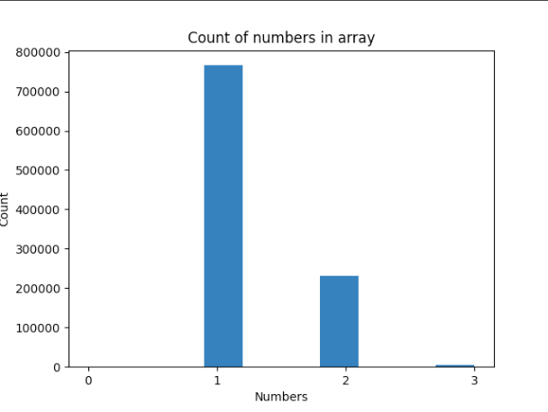
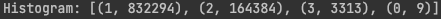

<h1>Paralel programming and distributed systems</h1>

<h3 style="display: inline">Subject
page:</h3> <a href="https://uim.fei.stuba.sk/predmet/i-ppds">https://uim.fei.stuba.sk/predmet/i-ppds </a>
<h2>Objective of the subject</h2>

The content of the course is the analysis of various synchronization patterns. 
Our goal is to offer students the opportunity to become familiar with various synchronization problems along with their 
solutions. By synchronization problems we mean the solution of the coordination of concurrently (perhaps also simultaneously)
performed tasks in order to ensure the integrity of the data with which the individual tasks work; of course, we also
demand that a correct calculation result be achieved.

In the second part of the semester, we focus on some modern areas of programming that are developing rapidly: parallel
calculations on graphics cards and asynchronous programming.

<h2>Organization</h2>
<ol>
<li>Introduction to parallel and distributed computing</li>
<li>Mutex, multiplex, turnstile, (reusable) barrier</li>
<li>Barrier and Fibonacci revisited - Producer-consumer, readers-writers, turnstile</li>
<li>Readers / writers again - Evening philosophers</li>
<li>Smokers, savages, scoreboard</li>
<li>Barber, H20, crossing the river, caterpillar track</li>
<li>Coprograms - Iterator, generator and carter in Python</li>
<li>Async IO - Async IO in Python</li>
<li>CUDA</li>
<li>CUDA continues</li>
</ol>

<h2>1. Exercise</h2>
<h3 style="display: inline">Exercise page:</h3> <a href="https://uim.fei.stuba.sk/i-ppds/1-cvicenie-oboznamenie-sa-s-prostredim-🐍 ">https://uim.fei.stuba.sk/i-ppds/1-cvicenie-oboznamenie-sa-s-prostredim-🐍 </a>

<strong>Problem: </strong>When we create an array of size 1000 for faster enforceability and the two threads start to increment the value
pointed by the indicator, everything looks good and every element of the array has value 1. If we change size of array
on 1 000 000, problem occurs. Many elements in array have value 2 or 3 but also 0. Sometimes, <u>list index out of range</u>
error occurs. This was due to the switching threads occurred after incrementing the value pointed by the indicator, and
thus the thread that incremented the value didn't increase the indicator.

We are going to use the sync tool lock (mutex) to solve this problem. When the thread aquire the lock, than others
threads, that also want to lock it, must wait. In our variation of using lock (mutex) we will not see time differences
because of GIL(Global interpreter lock) in python. GIL prevents the parallel execution of threads, but doesn't prevent
competitive execution, which is sufficient for our needs. Competitive events may or may not run simultaneously. We say
that events in the program are performed competitively if, due to the source code, we cannot determine in what order
they set [[1]](#1).
<h3>1. Variation</h3>

When we acquire lock on start of the while cycle, which iterate over whole array, sometimes <u>list index out of range</u>
error occurs. It is because other thread starts execute another cycle before thread with acquired 
lock increment the indicator. We changed it to acquire lock before while cycle and release it after while cycle ends.
Everything works fine, but we used small granularity and our program incremented values serially. The whole incrementation
of array was done by thread, which first acquired lock.

## References

<a id="1">[1]</a>
Matúš Jókay. PPaDS MMXXII.
<a href="https://uim.fei.stuba.sk/wp-content/uploads/2018/02/2022-01.uvod-do-paralelnych-a-distribuovanych-vypoctov.pdf">https://uim.fei.stuba.sk/wp-content/uploads/2018/02/2022-01.uvod-do-paralelnych-a-distribuovanych-vypoctov.pdf </a>

